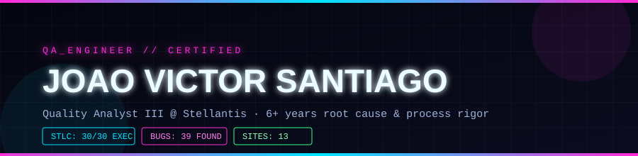

  

Quality Analyst III, on-site resident for the Stellantis client, and certified QA Engineer (Mate Academy).

6+ years finding root causes in automotive manufacturing (IATF 16949 / ISO 9001) — 8D, 5-Why, Pareto Analysis, Ishikawa. I brought that same rigor to software testing: led a full STLC cycle end-to-end (Test Plan → execution → bug report), and found 39 real bugs across 13 sites/apps — including a checkout-breaking bug on Domino's Brazil (live production) and a password-policy flaw on OWASP Juice Shop.

Before this, I built ARGOSYS, a full-stack quality-inspection system (React/TypeScript/Supabase) used in the field at WHB/Stellantis.

Portfolio repo, with everything detailed: **[github.com/jvsanti/qa-portfolio](https://github.com/jvsanti/qa-portfolio)**

**Stack:** SQL · Git · HTML/CSS · JavaScript · Playwright · Postman · Jira · TestRail

---

jv.santiago@live.com · [linkedin.com/in/jvsanti](https://linkedin.com/in/jvsanti)
